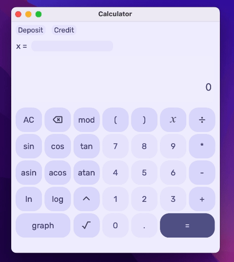
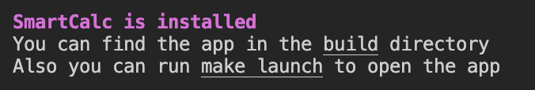
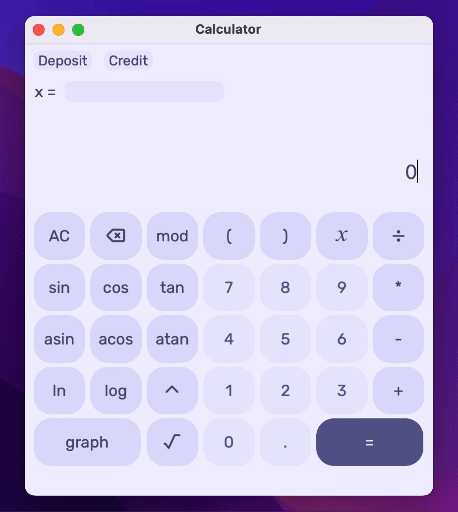
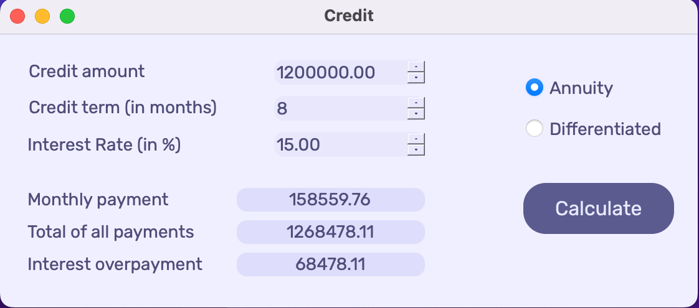
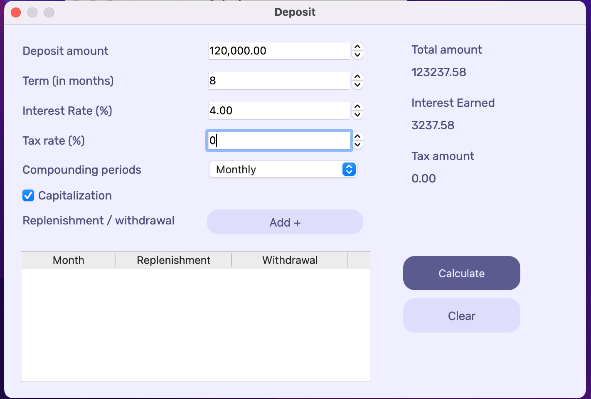

## SmartCalc v1.0
##### maybe not so smart but a bit pretty
---
This is an educational project for School 21.

You can find here an implementation of calculator which supports basic arithmetic operations such as ___addition___, ___substraction___, ___division___, ___multiplication___, ___power___. 
>Note that the multiplication operator contains the obligatory sign `*`

The program can calculate arithmetic expressions with substitution of the value of the variable x as a number.

You can enter both integers and real numbers with a dot into the program. 
The maximum length of an expression is 255 characters.

It also can computes some ___mathematical functions___: modulus, cosine, sine, tangent, arc cosine, arc sine, arc tangent, square root, natural logarithm and common logarithm.
  
      | Function description | Function |

      | modulus              | a mod b  |
      | cosine               | cos(x)   |
      | sine                 | sin(x)   |
      | tangent              | tan(x)   |
      | arc cosine           | acos(x)  |
      | arc sine             | asin(x)  |
      | arc tangent          | atan(x)  |
      | square root          | sqrt(x)  |
      | natural logarithm    | ln(x)    |
      | common logarithm     | log(x)   |

 

To install the app you need to clone this repository and from the src directory run __make__ in your terminal.
After installation completes you will see this message:

To uninstall the program, run __make uninstall__.

 

If you want to plot a graph of the function, press a _graph_ button:

>this app plots graphs without breakpoints :c

---

This application also contains two additional modes: 
1. __Loan__ (credit) calculator
- An annuity loan (a loan with constant repayment installments):

 

- A differential loan (a loan with a dynamic size of repayment installments):

 

2. __Deposit__ profitability calculator:

